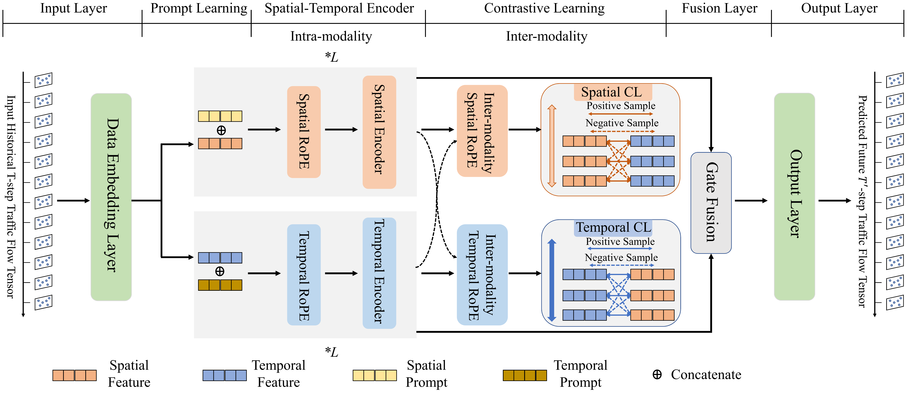

# Model



# References


# Requirements

+ python >= 3.6
+ scipy
+ tensorboard
+ pytorch

# Datasets

MDPM is implemented on those several public traffic datasets.
- **PEMS03**, **PEMS04**, **PEMS07** and **PEMS08** from [STSGCN (AAAI-20)](https://github.com/Davidham3/STSGCN).
Download the data [STSGCN_data.tar.gz](https://pan.baidu.com/s/1ZPIiOM__r1TRlmY4YGlolw) with password: `p72z` and uncompress data file using`tar -zxvf data.tar.gz` 


# Train and Test

- on all dataset  
  
  ```shell   
  python train_MDPM.py
  ```

- visualize training progress:
  
  ```
  tensorboard --logdir logs --port 6006
  ```
  
  then open [http://127.0.0.1:6006](http://127.0.0.1:6006) to visualize the training process.
  
- Please note that for each dataset, we will select the model parameters from the epoch that performs the best on its respective validation set as the parameters for testing.


# Configuration

The configuration file config.yaml contains six parts: Data, PEMS03, PEMS04, PEMS07, PEMS08, Training:

## Data

+ data_keys: the list of dataset names in all datasets
+ node_keys: the list of the number of nodes in all dataset
+ node_city: a dictionary contains <number of nodes, dataset name>

## PEMS[03,04,07,08]

+ num_of_vertices: number of vertices
+ points_per_hour: points per hour, in our dataset is 12
+ num_for_predict: points to predict, in our model is 12

## Training

+ ctx: set ctx = cpu, or set gpu-0, which means the first gpu device
+ epochs: int, epochs to train
+ learning_rate: float, like 0.0001
+ batch_size: int
+ num_of_weeks: int, how many weeks' data will be used
+ num_of_days: int, how many days' data will be used
+ num_of_hours: int, how many hours' data will be used
+ n_heads: int, number of temporal att heads will be used
+ d_k: int, the dimensions of the Q, K, and V vectors will be used
+ d_model: int, d_E
